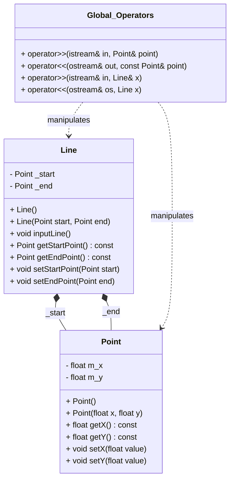
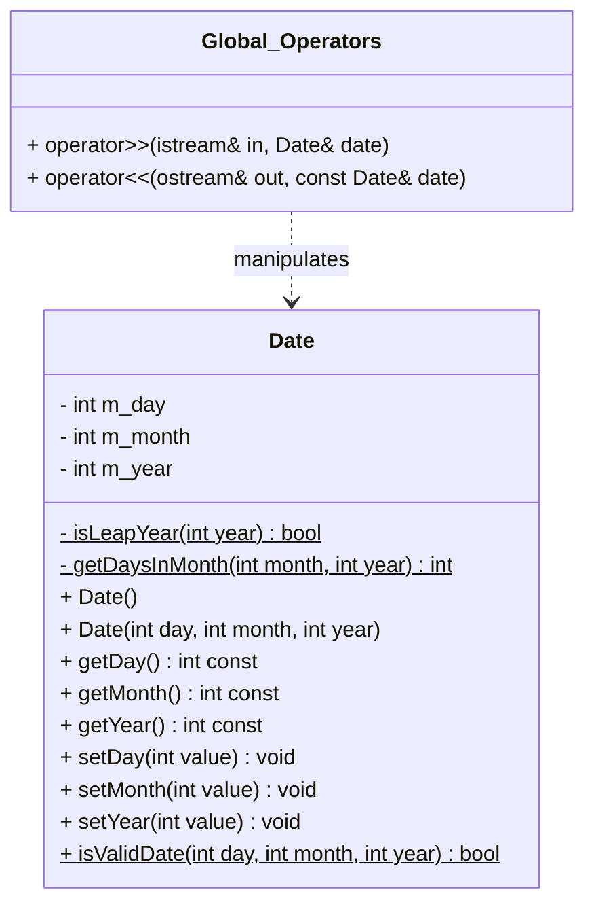
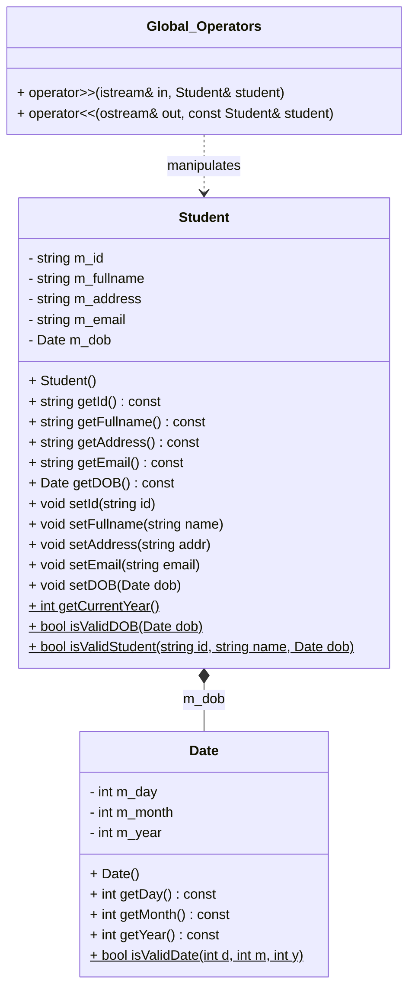
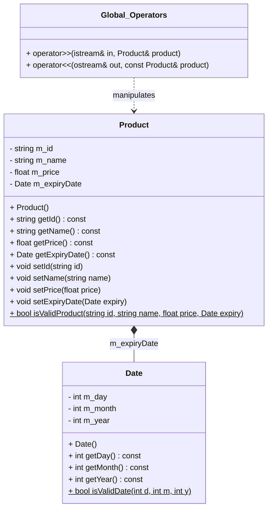

## Thông tin cá nhân
MSSV: **25127020**
Tên: **Nguyễn Phi Bảo Bình**

## Line & Point



## Sơ đồ lớp Date đầy đủ chi tiết



## Sơ đồ lớp Student và Date



## Sơ đồ lớp Product và Date




## Hướng Dẫn Biên Dịch

**Point**
```Bash
g++ ./*.cpp -o main
```

**Line**
```Bash
g++ ./*.cpp ./Utils/*.cpp ../Point/Point.cpp -o main
```

**Date**
```Bash
g++ ./*.cpp ./Utils/*.cpp -o main
```

**Student**
```Bash
g++ ./*.cpp ./Utils/*.cpp ../DateInput/Date.cpp -o main
```

**Product**
```Bash
g++ ./*.cpp ./Utils/*.cpp ../DateInput/Date.cpp -o main
```
## Hướng Dẫn Chạy
```Bash
./main
```

ChatBox AI:
```Bash
https://gemini.google.com/share/d/1wGtyvBs46CWZGRb5coerUTdbYN5xwBdG?usp=sharing
```
```Bash
https://gemini.google.com/share/d/1QZ1HSFPsIAJIQGQJhOlC1EHZe6BBuFQm?usp=sharing
```